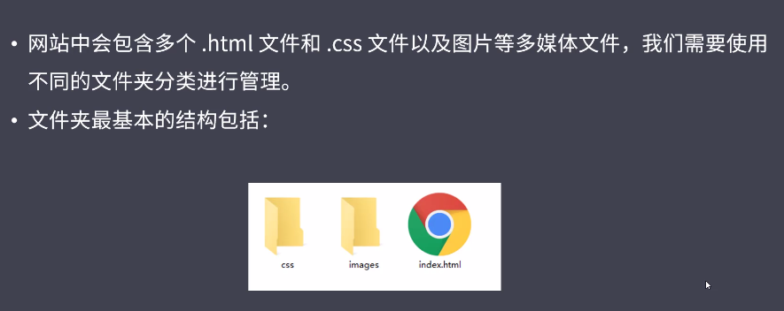

# flex 布局


## web 布局

开发流程

- 需求分析   产品定位比如 产品类型，产品功能，面向的客户群，达到的目的
- 整体规划   依据需求分析的结论，确定网站中要展示的内容，层次，展示形式
- 界面设计   设计师将各个页面进行设计，最终给出设计图
- 前端程序设计   根据设计图 进行代码编写，实现网页的界面和功能
- 前后台系统整合   后台进行数据库设计，将程序功能与界面进行整合，前后台配合进行功能调试
- 测试验收  项目经理及相关测试人员，对产品进行测试验收，测试产品交互效果，功能实现效果等

页面开发常见概念和布局

- 版心 


- 常见版心宽度包括  960px  980px 1200px 等

- 制作方法: 使用标准流中的margin居中

页面布局流程

为了提高网页制作的效率，布局时通常要遵守一定的布局流程

- 确定页面的版心（可视区域） 用 PS ||FW 量取
- 分析页面中的行模块，以及每个行模块中的列模块
- 制作 HTMl 页面，CSS 文件
- CSS 初始化，然后利用盒子模型的原理，通过 DIV+CSS 布局来控制页面的各个模块

常见布局模式

一列固定宽度且剧中


两列左窄右宽


通栏平均分布型


更多的情况，一个网页中可能同时包括2种以上的布局类型。

文件结构



css 分级引入


清除默认样式的 css 


淘宝 reset.css

```css
body, h1, h2, h3, h4, h5, h6, hr, p, blockquote, dl, dt, dd, ul, ol, li, pre, form, fieldset, legend, button, input, textarea, th, td { margin:0; padding:0; }  
    body, button, input, select, textarea { font:12px/1.5tahoma, arial, \5b8b\4f53; }  
    h1, h2, h3, h4, h5, h6{ font-size:100%; }  
    address, cite, dfn, em, var { font-style:normal; }  
    code, kbd, pre, samp { font-family:couriernew, courier, monospace; }  
    small{ font-size:12px; }  
    ul, ol { list-style:none; }  
    a { text-decoration:none; }  
    a:hover { text-decoration:underline; }  
    sup { vertical-align:text-top; }  
    sub{ vertical-align:text-bottom; }  
    legend { color:#000; }  
    fieldset, img { border:0; }  
    button, input, select, textarea { font-size:100%; }
```

公共样式


header 区域


search 区域


性能优化  函数节流 防抖

content 区域


main 部分


## 移动 web

移动端开发，不需要关心浏览器兼容性，因为移动浏览器几乎都是基于 webkit 内核研发的。但是移动端的弊端是手机屏幕碎片化严重

- Android 设备有很多分辨率 480x800，480x854，540X960，720X1280,1080X1920等
- iPhone 的碎片化也很严重，640X960，640X1136，750X1334，1242X2208等

但是作为 web 开发者我们无需关心这些分辨率，我们只要关注设计稿尺寸  px 就行

视口 viewport

- 布局视口

  一般移动设备的浏览器都默认设置了一个布局视口，用于解决早期的pc端页面在手机上显示的问题，一般手机的布局视口大小是 980 px （document.documentElement.clientWidth 获取，前提是不要做视口处理）

  

- 视觉视口

  用户看到的网站的区域

  

- 理想视口

为了是网站在移动端有最理想的浏览和阅读宽度而设定

需要手动填写 <meta name="viewport">


像素

- 物理像素

​    指的就是屏幕显示的最小颗粒，是物理真实存在的，这是厂家在出厂的时候就设置好的 比如iphone6/7/8 物理像素  750X1334 就是手机的分辨率

- css 像素

  程序开发中使用的一种单位名称，记录我们设置的大小，比如 width:300px;

  注意:

  - pc 端1物理像素==1css像素
  - 移动端不确定 由物理像素比（DPR）决定 DPR为2 说明一个css像素占据2个物理像素

  

- 物理像素比

  

多倍图

- 对于一张 50X50的图片，在手机 Retina 屏中打开，按照刚才的物理像素比会放大倍数，这样会造成图片模糊
- 在标准 viewport 下，使用高倍图解决这种问题


设计师一开始 按照启动图尺寸设计，然后缩放到开发尺寸。

移动端常见问题


css初始化


https://github.com/necolas/normalize.css/

https://necolas.github.io/normalize.css/latest/normalize.css

CSS3盒子模型


特殊样式


布局

- 流式布局（百分比布局）

  代表 京东移动端

  

- flex 弹性布局

  代表 携程网

  

  布局原理

​        

- 采用flex布局的元素，成为flex容器，他的所有子元素会自动成为容器成员

- flex 布局就是通过给父盒子添加 flex 属性，来控制子盒子的位置和排列方式

- 属性讲解

  - 父级常见属性

    - flex-direction 设置主轴的方向    主轴方向可以更改  定义水平还是垂直 为主轴  一旦定义了主轴 另一个就是侧轴
    - justify-content 设置主轴上的子元素的排列方式
    - flex-wrap 设置子元素是否换行
    - align-content 设置侧轴上的子元素的排列方式（多行）
    - align-items 设置侧轴上的子元素的排列方式 （单行）
    - flex-flow 复合属性，相当于同时设置了 flex-direction和flex-wrap

  - 详细内容

    - flex-direction 

      

      

      justify-content

      

      flex-wrap

      

      ```html
         <style>
              div{
                  width:800px;
                  height:200px;
                  background: pink;
                  display: flex;
                  flex-wrap: nowrap;
              }
              span{
                  background: yellow;
                  width: 150px;
                  height: 100px;
              }
          </style>
          <div>
              <span>1</span>
              <span>2</span>
              <span>3</span>
              <span>4</span>
              <span>5</span>
              <span>6</span>
              <span>7</span>
          </div>
      /*子元素宽度叠加超过父元素宽度 会重新计算再平分*/
      ```

      align-items  只能用于子元素为单行的时候，不能用于多行的时候

      

      stretch 子元素如果设置了高度，该属性不起效果 ，如果主轴设置为colunm 不能设置width

      align-content  只适合多行子元素的时候，单行子元素不起作用

      

      align-content 和 align-item 的区别

      

      flex-wrap 复合属性

      
      
      

  - 子项常见属性

    - flex 

      

    - align-self 控制子项自己在侧轴上的排列方式

      

      order 定义子元素的排列顺序  可以为负数（排在第一个元素的前面）

      

  - 问题

  

  - rem

  

- 媒体查询

  语法规范

  

--------------------------------------------------------------------


